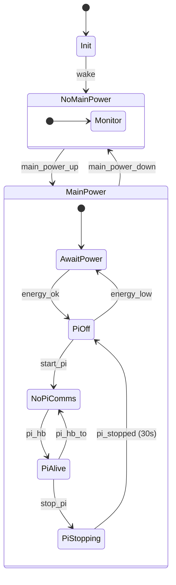

# Compute

- Initial tests used a Raspberry Pi Zero 2 W board as the main compute, but the 512MB of memory proved for containerized InfluxDB and Telegraf, never mind Grafana or actual application logic. 
- Testbed development now proceeding with a Raspberry Pi 3+ (1GB memory), which is performing better. 
- 8GB Raspberry Pi 4 on order.

## Components

- Raspberry Pi 4 Model B with 8GB memory
    - USB-connected GPS
    - RP2040 (below)
        - UART connection for operational data
        - USB connection for power and programming

- RP2040 Feather microcontroller running MicroPython
    - UART-connected Victron MPPT
    - I2C-connected INA260 current/voltage monitor reading main battery voltage and aggregate load of compute and sensors
    - I2C-connected 9-DOF IMU
    - propulsion motor ESC
    - rudder servo

## System States

There are two compute elements of interest when it comes to understanding the overall system state: the RP2040 microcontroller and the RPi 4 main compute. The former manages basic power system data collection and control, and will be powered on as long as any energy is available in either the main battery or the low-voltage backup battery. The RPi provides long-term data retention, tracking, planning, and communications, and may or may not be powered on at any given time, depending on main battery power availability. It may be shut down preemptively to conserve power, and is not served by the low-voltage backup.

### States

- Init: initial state, where no information about the system is yet available
- NoMainPower: superstate encompassing all operations where the main battery is exhausted or too low a voltage
  - Monitor: stable state wherein the RP2040 is monitoring and recording power levels but the ship is otherwise idle, waiting for sufficient power to be available for normal operations.
  - PiStarting: sufficient main power is available to boot the RPi, but it has not yet checked
  - PiBootFailed: 

