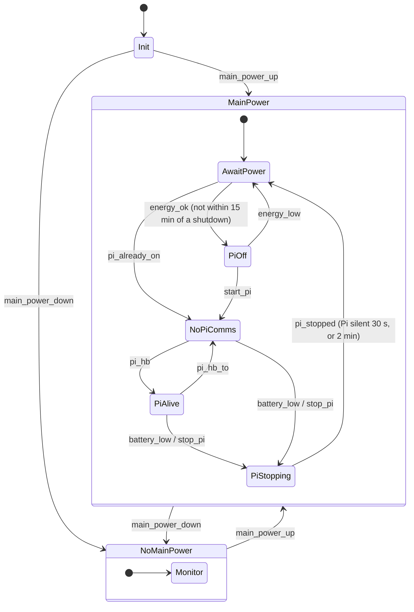

# Compute

- Initial tests used a Raspberry Pi Zero 2 W board as the main compute, but the 512MB of memory proved for containerized InfluxDB and Telegraf, never mind Grafana or actual application logic. 
- Testbed development now proceeding with a Raspberry Pi 3+ (1GB memory), which is performing better. 
- 8GB Raspberry Pi 4 on order.

## Components

- Raspberry Pi 4 Model B with 8GB memory
    - RP2040 (below)
        - UART connection for operational data
        - USB connection: a fallback for programming only; deploys normally go over the UART (see `tools/README.md`). Its 5V (VBUS) line must be cut: the RP2040 runs from its own supply, and a live VBUS back-powers the Pi through its USB port, so its power switch can no longer turn the Pi off.

- RP2040 Feather microcontroller running MicroPython
    - UART-connected Victron MPPT (UART1: RX on GPIO9; the unused TX is parked on GPIO24 so it can't clash with the ESC on GPIO8)
    - I2C-connected INA260 current/voltage monitor reading main battery voltage and aggregate load of compute and sensors
    - I2C-connected 9-DOF IMU: an Adafruit BNO085 (on-chip sensor fusion) at 0x4A, daisy-chained on the STEMMA QT bus (I2C1) after the GPS. The firmware only checks that it answers (`imu_present` in status). The BNO085 holds the I2C clock low at times, and some hosts struggle with that; if INA260 or GPS errors rise, move it to its own bus or its UART mode. (Replaced an LSM9DS1 on I2C0 in October 2026; that board ran hot, drawing about 0.3 W, and was probably damaged.)
    - LiPo voltage: the Feather's BAT pin through a 100k/100k divider (0.1 uF at the pin) to A0/GPIO26, reported as `lipo_v` in status. Only approximate below about 3.4 V, where the 3.3 V reference sags.
    - The Pi supply's power-good (PG): GPIO10, through a 10k/15k divider fed by that supply's own 5 V output, so it reads high only while the Pi's supply is on and in range. Reported as `pi_supply_good`. If it stays low for 3 s while the Pi should be powered, the firmware reports a `pi_supply_fault` event (and `pi_supply_good` on recovery).
    - I2C-connected GPS: Adafruit Mini GPS PA1010D on the STEMMA QT connector (I2C1, GPIO 2/3, shared with the INA260). The RP2040 keeps position and UTC while the Pi is off, and timestamps its messages (`utc_ms`) once it has a fix.
    - propulsion motor ESC
    - rudder servo

## System States

There are two compute elements of interest when it comes to understanding the overall system state: the RP2040 microcontroller and the RPi 4 main compute. The former manages basic power system data collection and control, and will be powered on as long as any energy is available in either the main battery or the low-voltage backup battery. The RPi provides long-term data retention, tracking, planning, and communications, and may or may not be powered on at any given time, depending on main battery power availability. It may be shut down preemptively to conserve power, and is not served by the low-voltage backup.

### Power safety rules

The RP2040 must be able to restart, crash, or be reprogrammed without taking the Pi down with it, and must never leave the Pi half-powered.

- Power supplies (since 2026-10-21), both fed from the MPPT's load output:
  - Always on: a Pololu D24V7F5 (5 V, 600 mA, efficient at light load) feeds the Feather's USB pin. The Feather's own regulator makes 3.3 V for the sensors, and its LiPo carries the RP2040 when the load output is off.
  - The Pi: a Pololu D36V28F5 (5 V, 3.2 A) with an enable input. EN is pulled up to the battery voltage on the regulator board, so it is switched through one channel of a BSS138 level shifter: LV to the Feather's 3.3 V, LV1 to GPIO11, HV1 to EN, HV unconnected. GPIO11 high (or floating) leaves EN high and the Pi powered; GPIO11 low pulls EN low and turns the Pi's supply off.
- The Pi's supply must stay on while the RP2040 is in reset, so that an RP2040 restart doesn't cut a running Pi. It does: the level shifter's 10k pull-up on LV1 holds the pin high while the RP2040 isn't driving it (verified 2026-10-21 with a deploy, during which the Pi didn't reboot). `deploy.sh` checks this on every deploy.
- `boot.py` settles the Pi's power before anything else runs (`power_policy.py`):
  - Power-on reset (a cold start, including the reset button): Pi off. The whole system may be waking at dawn on a nearly empty battery, and the Pi must not start, brown out, and repeat. It starts only when the FSM's energy rules allow.
  - Watchdog reset (a crash, a hang, or the reset at the end of a deploy): restore the power state the firmware last chose deliberately, which it records in a `pi_power` file on each change.
  - Soft reset (Ctrl-D): leave the pin alone.
- The firmware only changes Pi power deliberately: starting it when energy allows, and cutting it on loss of main power or after a requested shutdown.
- Because the Pi's supply defaults to on, it is also on for the moment (under a second) between the RP2040 starting and `boot.py` running. That happens at a cold start, which at dawn only comes once the MPPT's load output has reconnected, and at a watchdog reset while the Pi was deliberately off. Powering a stopped Pi for a moment is harmless; cutting a running one is not.
- No other connection may supply power to the Pi while its supply is off (see the USB note above). With the supply off, the Pi's red LED must go fully dark.
- The watchdog is fed only while the main loop is running, so a crash or hang ends in a reset. Interrupting the main loop from the console (Ctrl-C, as a deploy does) holds the watchdog off for 15 minutes. A `nowdt` file on the RP2040 disables it for bench work.
- After three consecutive boots that crash before running healthily for a minute, the RP2040 comes up in safe mode: watchdog off, the Pi's power left as `boot.py` set it, REPL free for a deploy to repair it. Safe mode retries normal operation after an hour, and puts the REPL on the UART. Crashes are logged to `crash.log` on the RP2040.
- If the firmware fails before it's running (for example a broken import), `main.py` reports `startup_failed` to the Pi and moves the REPL onto the UART. Every failure short of a hang before the watchdog starts can therefore be repaired with a serial deploy, without USB.

### Time and telemetry

- The RP2040 keeps UTC from the GPS and stamps every message with it (`utc_ms`). The Pi's monitor writes points with that time, and feeds the GPS time from live fixes to chrony as a reference clock, so the Pi's clock is right without the internet. Internet NTP is preferred when it's reachable, because GPS time without a PPS signal is only good to about 0.1 s.
- The monitor sends a heartbeat (`{"cmd": "hb", "ack": N}`) every 2 s over the UART. Without one for 10 s, the RP2040 treats the Pi as down. Its FSM moves from PiAlive to NoPiComms, and every 60 s it stores a snapshot of its latest readings and status on flash (`telemetry_log.py`; a sensor message that hasn't changed isn't stored again). The log is capped at 4 MB, about 55 hours, and always leaves 1 MB of flash free for a deploy. When it's full the oldest records go first, except events (shutdown requests, power cuts, Pi up/down), which are kept. Events (boot, Pi power changes, shutdown requests, crashes, maintenance) are always stored as well as sent, even while the Pi seems to be listening: a power cut takes the Pi down at once, seconds before the heartbeat timeout notices. When heartbeats resume, it replays the log alongside live data. `ack` is the highest replayed sequence number the monitor has written to InfluxDB; records are deleted only once acknowledged.
- Every status record carries `pi_up`, and records made while the Pi is down are replayed, so the Pi's up/down history in `rp2040_status` has no gaps.

### States

- Init: initial state, where no information about the system is yet available. The Pi's power is left alone until the first battery voltage reading.
- NoMainPower: superstate encompassing all operations where the main battery is exhausted or too low a voltage. Entering it cuts power to the Pi and the drive.
  - Monitor: stable state wherein the RP2040 is monitoring and recording power levels but the ship is otherwise idle, waiting for sufficient power to be available for normal operations.
- MainPower: the main battery is above the main-power threshold (12.6V up, 12.4V down), and the MPPT's load output is live: the Victron reports it on, and the INA260 doesn't read the load side as dead (below 9 V). The load output reconnects at 13.2 V, above the Pi's 13.0 V restart level, and the Victron keeps reporting battery voltage while it's off, so battery voltage alone can't show the Pi's supply is there.
  - Low battery: once the battery has stayed below 12.8 V for 2 minutes (roughly 15-20% charge for LiFePO4 at these loads), the RP2040 shuts the Pi down cleanly. It asks the monitor to power off over the UART, waits until the Pi has been silent for 30 s (or 2 minutes at most), cuts its power, and goes to AwaitPower. The rest of the battery keeps the RP2040 and GPS running and logging.
  - The Victron's load output (which feeds the DC-DC converter for both the RP2040 and the Pi) uses VictronConnect's user-defined mode: off below 12.0 V, on above 13.2 V. So the order as the battery drains is: Pi shut down cleanly at 12.8 V; load output off at 12.0 V (the RP2040 continues on its LiPo); battery's own protection last. The load output comes back once solar charging lifts the battery above 13.2 V.
  - Restart: the Pi is started again only when energy is OK (battery above 13.5 V, or more than 10 W of solar) and the battery is at least 13.0 V, and not within 15 minutes of a deliberate shutdown.
  - AwaitPower: not enough energy to start the Pi. If the Pi is already running (for example after an RP2040 reset), it is left running and the state moves to NoPiComms.
  - PiOff, NoPiComms, PiAlive, PiStopping: the Pi's lifecycle.

The battery voltage comes from the Victron MPPT, or from the INA260 when the MPPT hasn't reported for 30 seconds.

```mermaid
stateDiagram
    [*] --> Init
    state NoMainPower {
        direction LR
        [*] --> Monitor
    }
    state MainPower {
        [*] --> AwaitPower
        AwaitPower --> PiOff : energy_ok (not within 15 min of a shutdown)
        AwaitPower --> NoPiComms : pi_already_on
        PiOff --> AwaitPower : energy_low
        PiOff --> NoPiComms : start_pi
        NoPiComms --> PiAlive : pi_hb
        PiAlive --> NoPiComms : pi_hb_to
        PiAlive --> PiStopping : battery_low / stop_pi
        NoPiComms --> PiStopping : battery_low / stop_pi
        PiStopping --> AwaitPower : pi_stopped (Pi silent 30 s, or 2 min)
    }
    Init --> MainPower : main_power_up
    Init --> NoMainPower : main_power_down
    NoMainPower --> MainPower : main_power_up
    MainPower --> NoMainPower : main_power_down

```