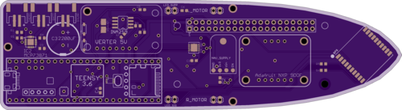

# Roboat Core PCB

## Overview

The main board is 6.21" long and 1.70" wide, two layers, and looks like this (images produced by [OSH Park](http://oshpark.com), which is doing the fabrication):

**Top**

**Bottom**

### BOM

Component | Quantity | Status
--- | --- | ---
Teensy 3.6 | 1 | Ready
Raspberry Pi Zero W w/SD | 1 | Ready
[Adafruit 5V Buck/Boost DC/DC converter](https://www.adafruit.com/product/2190) | 1 | Ready
[Adafruit LM3671 3.3V Buck DC/DC converter](https://www.adafruit.com/product/2745) | 1 | Ready
[Adafruit NXP 9DOF IMU Breakout](https://www.adafruit.com/product/3463) | 1 | Ready
[Adafruit MTK3339 GPS module](https://www.adafruit.com/product/790) | 1 | Ready
[JST-PH 2-Pin socket](https://www.adafruit.com/product/1769) | 3 | Ordered
2200uF electrolytic capacitor (0.5" OD) | 1 | Ready
[MCP73871 LiPo charger IC](https://www.digikey.com/scripts/DkSearch/dksus.dll?Detail&itemSeq=242840697&uq=636454382935610659) | 1 | Ordered
[INA219 I/V sensor IC](https://www.digikey.com/scripts/DkSearch/dksus.dll?Detail&itemSeq=241694490&uq=636455072904554334) | 1 | Ordered
[PCA9306 level shifter IC](https://www.digikey.com/scripts/DkSearch/dksus.dll?Detail&itemSeq=242979904&uq=636455072904574338) | 1 | Ordered
[DRV8836 motor driver IC](https://www.digikey.com/product-detail/en/texas-instruments/DRV8836DSSR/296-30392-1-ND/3188674) | 1 | Ready
[0.05 ohm sense resistor](https://www.digikey.com/scripts/DkSearch/dksus.dll?Detail&itemSeq=241709990&uq=636455074692421836) | 1 | Ordered
[Schottky 20V/1A diode](https://www.digikey.com/scripts/DkSearch/dksus.dll?Detail&itemSeq=242326868&uq=636455074692421836) | 2 | Ordered
1uF 0306 SMD capacitor | 5 | Ready
1K ohm 0306 SMD resistor | 1 | Ready
50 ohm 0306 SMD resistor | 2 | Ready
10K ohm 0306 SMD resistor | 2 | Ready
20K 0306 SMD resistor | 1 | Ready
100K ohm 0306 SMD resistor | 2 | Ready
270K 0306 SMD resistor | 1 | Ready
2x20 0.1" female pin socket | 1 | Ready
[10K NTC thermistor](https://www.adafruit.com/product/372) | 1 | Ordered